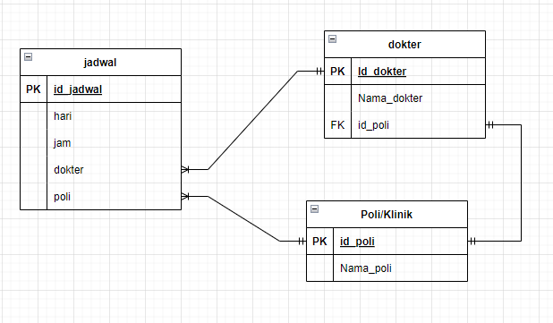

## <div align="center"> Jadwal Dokter 💻</div>

### 📋 Documentation:
Can read in [Open API Documentation](https://app.swaggerhub.com/apis-docs/klukmanul33/jadwalDokter_API/1.0.0#/) (Swagger)

###  Relation:


### ❓ How To Run
1. edit env file
```bash
DB_PWD = "masukkan password"
DB_PORT = "masukkan port"
```

2. run
```bash
cd jadwaldokter
go run server.go
```
### 📱 Endpoint
poli
```bash
POST /poli
GET /poli
DELETE /poli/:id
```
dokter
```bash
POST /dokter
GET /dokter
DELETE /dokter/:id
```
jadwal
```bash
POST /jadwal
GET /jadwal
DELETE /dokter/:id
```
jadwal filtering
```bash
GET /jadwal?key="masukkan kata kunci"
```